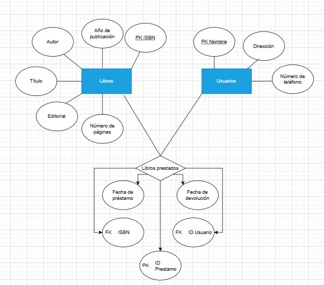
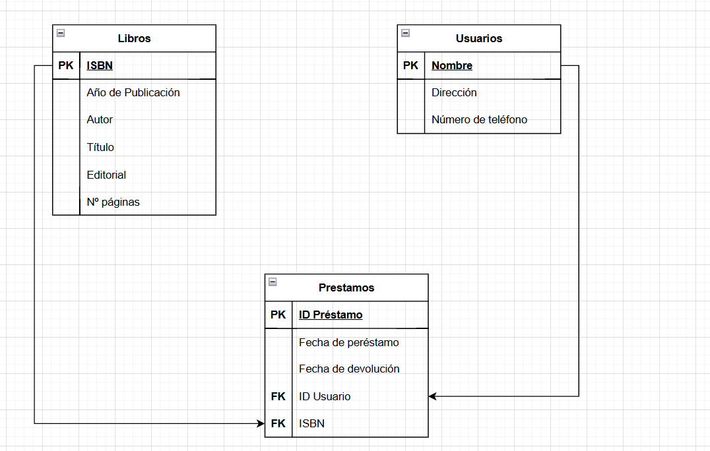

# Ejercicio 1: Biblioteca

## Descripción

Diseña una base de datos para una biblioteca que permita gestionar los libros y los préstamos.

## Requisitos

1. La biblioteca tiene libros. Cada libro tiene un **título**, **autor**, **editorial**, **año de publicación** y **número de páginas**.
2. Los usuarios de la biblioteca pueden tomar libros prestados. Cada usuario tiene un **nombre**, **dirección** y **número de teléfono**.
3. Cada préstamo de libro debe registrar la **fecha de préstamo**, la **fecha de devolución** y el **usuario** que tomó prestado el libro.

## Tareas

1. Identifica las **entidades principales** y sus **atributos**.
2. Define las **relaciones** entre las entidades.
3. Crea un **diagrama ERD** que represente el diseño de la base de datos.

# Ejercicio 2: Tienda en línea

## Descripción:

Diseña una base de datos para una tienda en línea que gestione productos,
clientes y pedidos.

## Requisitos:

1. La tienda tiene productos. Cada producto tiene un **nombre**, **descripción**,
   **precio** y **cantidad en stock**.
2. Los clientes pueden registrarse en la tienda. Cada cliente tiene un **nombre**,
   **dirección de correo electrónico** y **número de teléfono**.
3. Los clientes pueden realizar pedidos. Cada pedido debe registrar la **fecha del pedido**,
    los **productos** comprados, la **cantidad** de cada producto y el
    **cliente**que realizó el pedido.
## Tareas:

1. Identifica las **entidades principales** y sus **atributos**.
2. Define las **relaciones** entre las entidades.
3. Crea un **diagrama ERD** que represente el diseño de la base de datos.

![]
![]